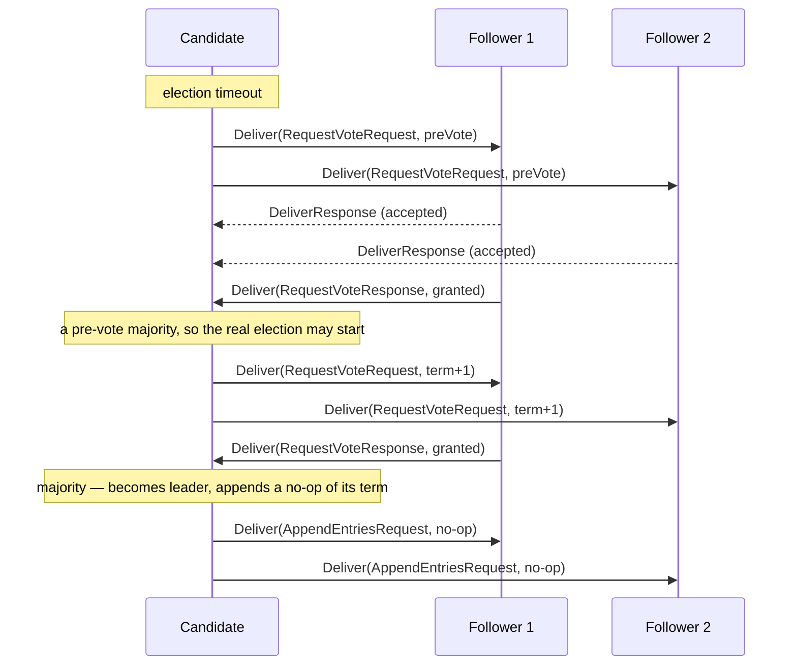
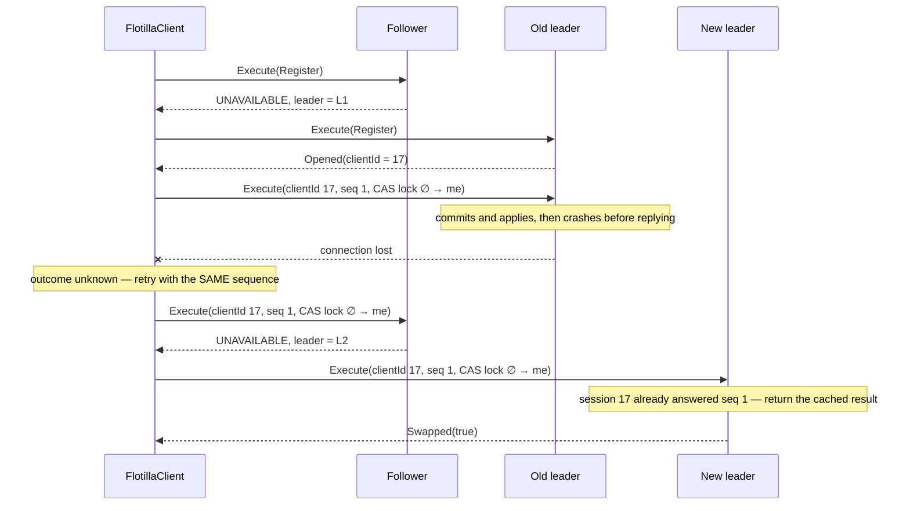

# Wire protocol

Two gRPC services share one port on every node. Both are defined in `proto/flotilla/v1/`, linted by
`buf` on every push and checked for breaking changes on every pull request.

| Service | RPC | Used by | Carries |
|---|---|---|---|
| `RaftPeerService` | `Deliver` | nodes | one Raft message per call |
| `ClientService` | `Execute` | clients | one encoded state machine request per call |

Every numeric field is `int64`. Java's `long` maps onto it exactly; `uint64` would force every
mapping site to reason about the sign bit.

## Peer messages

`DeliverRequest` is an envelope: `from`, `to`, `term`, and a `oneof` with one variant per Raft
message type. The reply, `DeliverResponse`, is empty. It confirms that the receiving node accepted
the envelope into its event queue — nothing more. **Raft responses are not RPC replies**; they are
envelopes of their own, sent back through `Deliver`.

That makes delivery one-way, which is the model the consensus core was written for and the model
the deterministic simulation tests against: a message may be dropped, delayed, duplicated or
reordered, and the core must stay safe under all four.

A receiving node refuses an envelope with:

| Status | When |
|---|---|
| `INVALID_ARGUMENT` | the envelope is empty, or a field holds a value no valid message can hold |
| `FAILED_PRECONDITION` | the envelope is addressed to a different node |

The second check exists because the core treats a misaddressed message as a programming error and
throws, and the event loop stops on any exception. On the network such a message is an input, not a
bug, so it is refused before it can reach the queue.

### Election



### Replication

```mermaid
sequenceDiagram
    participant L as Leader
    participant F1 as Follower 1
    participant F2 as Follower 2

    L->>L: append entry, fsync (batched)
    L->>F1: Deliver(AppendEntriesRequest, prevLogIndex, entries)
    L->>F2: Deliver(AppendEntriesRequest, prevLogIndex, entries)
    F1->>F1: append, fsync
    F1->>L: Deliver(AppendEntriesResponse, success, matchIndex)
    Note over L: leader + F1 is a majority, entry is of the current term
    L->>L: advance commit index, apply
    L->>F1: Deliver(AppendEntriesRequest, leaderCommit)
    L->>F2: Deliver(AppendEntriesRequest, leaderCommit)
    Note over F2: F2's reply was lost; the next append retries it
```

A rejected append carries a conflict hint — `conflictIndex` and `conflictTerm` — so the leader can
skip a whole term of divergent entries instead of backing up one index per round trip.

### Delivery limits

- At most `maxInflightPerPeer` deliveries to one peer are outstanding at once. A message that finds
  no free slot is dropped and counted.
- Each delivery has a deadline, which must be shorter than the minimum election timeout. A node
  refuses to start otherwise.
- The maximum message size must exceed the largest append a leader may send, framing included. A
  node refuses to start otherwise.
- Channels reconnect with gRPC's jittered backoff. A message received from a peer whose channel is
  backing off resets that backoff at once.

## Client requests

`ExecuteRequest.command` holds the state machine's own canonical encoding of a request — for the
key-value store, a `KvRequest` as specified by `CommandCodec`. `ExecuteResponse` returns the log
index the command was applied at and the state machine's encoded result.

The node validates the command before proposing it and otherwise never looks inside. Deduplication
happens in the state machine, keyed by the session the request carries, so a retried request with
the same session and sequence is answered from the cache rather than run again.

### Errors

| Status | Meaning | Retry? |
|---|---|---|
| `UNAVAILABLE` with `flotilla-leader-id` and `flotilla-leader-address` trailers | not the leader; go there | yes, immediately |
| `UNAVAILABLE` without trailers | no leader known, or the node is stopping | yes, elsewhere, with backoff |
| `RESOURCE_EXHAUSTED` | the node's event queue is full | yes, same node, with backoff |
| `DEADLINE_EXCEEDED` | no answer in time; the command may have run | yes, same sequence |
| `INVALID_ARGUMENT` | the command cannot be decoded | no |

A rejected session is not a status code. It is a result, `Rejected(UNKNOWN_SESSION)` or
`Rejected(STALE_SEQUENCE)`, returned by the state machine like any other answer.

### A request that survives a leader change



Without the session the retry would have executed again, found the lock taken — by itself — and
answered `Swapped(false)`.

## Compatibility rules

- Field numbers are never reused. Removed fields are `reserved`.
- New message types are new `oneof` variants with new field numbers. An older node receiving one
  refuses it with `INVALID_ARGUMENT` rather than misinterpreting it.
- Breaking checks use `buf`'s `WIRE` rule set. Nodes exchange binary protobuf only, so field names
  never cross the wire and renaming one is not a compatibility break.
